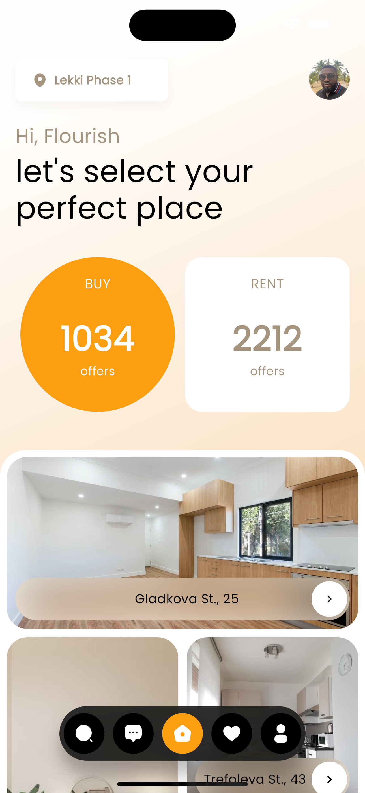
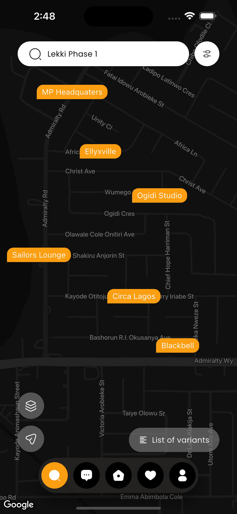

# Real Estate App - Moniepoint

<b>Resources:</b>

1. [Design on Dribble (Real Estate App)](https://dribbble.com/shots/real-estate-app)
2. [Installable APK build](https://github.com/Oluflourish/real_estate_app_mp/blob/master/ss/real_estate_app_mp.apk)
3. [App Demo Video (.mp4)](https://drive.google.com/file/d/17GirAAW5-0elQUVqn_kNXftDlV9sa5eq/view?usp=sharing)

## 📸 Result

| Demo                                                   | Home Tab                                    | Search Tab                                  |
| ------------------------------------------------------ | ------------------------------------------- | ------------------------------------------- |
|  |  |  |

 

## Dribble Demo

 

## ✨ Features

- State management: Riverpod
- Google Maps (Dark Mode)
- Google Map Custom Markers
- Flutter Screen Util (to scale font & widget sizes)
- Fonts (GoogleFonts - poppins)
- Screens
  - Home Tab
  - Search Tab
# real_estate_app_mp
